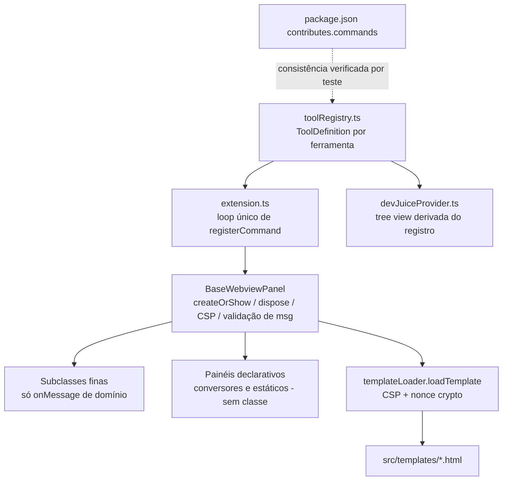

# Unificação da Arquitetura de Webviews — Design

**Spec**: `.specs/features/webview-architecture-unification/spec.md`
**Status**: Draft

---

## Abordagens consideradas (Large — exploração obrigatória)

**Recomendada — A. Classe base + registro declarativo (escolhida).**
Uma `BaseWebviewPanel` concentra o ciclo de vida; um `toolRegistry.ts` declara cada ferramenta.
Ferramentas sem lógica no host (17 conversores + estáticas) usam a base diretamente via entrada
declarativa; ferramentas com `onDidReceiveMessage` viram subclasses finas que só implementam o
handler. Prós: menor diff conceitual, migração incremental ferramenta a ferramenta, preserva
templates atuais. Contras: subclasses ainda existem (~15), mas contêm apenas lógica de domínio.

**B. Migrar tudo para um único `GenericToolPanel` com handlers plugáveis por configuração.**
Nenhuma subclasse; handlers como funções registradas. Prós: zero classes. Contras: handlers com
estado (QR reader, PIX) ficam artificiais; config vira uma DSL implícita mais difícil de tipar e
testar que subclasses. Rejeitada: complexidade movida, não removida.

**C. Reescrever a camada de UI (webview única com roteador interno, SPA).**
Prós: deduplicaria também os 34 templates. Contras: reescreve comportamento visível, invalida o
escopo "refatorar sem mudar UX", risco alto sem testes preexistentes. Rejeitada aqui; vira
candidata natural de follow-up quando esta base existir.

---

## Architecture Overview



Fluxo: `activate()` percorre o registro e registra um comando por entrada. O comando resolve a
fábrica da entrada (lazy `require`, preservando o padrão atual) e chama `createOrShow` da base. A
base mantém um mapa estático `viewType → painel ativo` (substitui 36 singletons copiados), carrega o
HTML exclusivamente via `loadTemplate` e instala um dispatcher de mensagens que valida
`command`/payload antes de delegar ao handler da subclasse.

---

## Code Reuse Analysis

### Existing Components to Leverage

| Component | Location | How to Use |
| --------- | -------- | ---------- |
| `loadTemplate` (cache + CSP + nonce) | `src/utils/templateLoader.ts` | Único caminho de HTML na base; já usado por 30 providers |
| `sanitizeHTML`, `validateUserInput`, `secureHash` | `src/utils/securityUtils.ts` | Validação de payload na base; sanitização do fallback PIX; `generateNonce` será corrigido, não substituído |
| Lógica de domínio existente (`_encodeBase64`, conversão de cores, etc.) | `src/providers/*.ts` | Movida intacta para as subclasses finas — sem reescrita de algoritmos |
| Utilitários puros | `src/utils/{cpf,cnpj,uuid,pix}Generator.ts`, `textFormatter.ts` | Inalterados; ganham testes unitários |
| Infra de teste declarada | `package.json` (`vscode-test`, `@vscode/test-cli`, mocha) | Ativada com `.vscode-test.mjs` + `src/test/` — sem dependência nova |
| Padrão lazy-load de providers | `src/extension.ts` (`lazyProviders`) | Preservado como campo `factory: () => …` na entrada do registro |

### Integration Points

| System | Integration Method |
| ------ | ------------------ |
| Command palette / keybindings | `contributes.commands` mantido no `package.json`; teste de consistência trava divergência com o registro |
| Activity bar tree (`devJuiceExplorer`) | `DevJuiceProvider` deixa de ter listas hardcoded e agrupa entradas do registro por `category` |
| Comandos de editor (`insert*`, `formatText*`, `ansiFormatterProcessSelection`) | Fora do registro de painéis (não abrem webview); continuam registrados diretamente, mas extraídos para `src/commands/editorCommands.ts` para desinchar `extension.ts` |

---

## Components

### `ToolDefinition` + `toolRegistry`

- **Purpose**: Fonte única de verdade sobre as ferramentas de painel (id do comando, título, categoria, ícone codicon, template, fábrica lazy).
- **Location**: `src/tools/toolRegistry.ts`
- **Interfaces**:
  - `interface ToolDefinition` — ver Data Models
  - `getTools(): readonly ToolDefinition[]`
  - `getToolsByCategory(): Map<ToolCategory, ToolDefinition[]>`
- **Dependencies**: nenhuma (dados puros + `require` lazy nas fábricas)
- **Reuses**: ids de comando e títulos atuais de `package.json`/`extension.ts` (sem renomear comandos — compatibilidade com keybindings de usuários)

### `BaseWebviewPanel`

- **Purpose**: Todo o ciclo de vida de webview em um lugar: singleton por `viewType`, `reveal`, `dispose`, carregamento de template com CSP, dispatcher de mensagens validado.
- **Location**: `src/panels/BaseWebviewPanel.ts`
- **Interfaces**:
  - `static createOrShow(def: PanelInit, extensionUri: vscode.Uri, ctor?: PanelSubclassCtor): void` — cria ou revela; mapa estático `Map<string, BaseWebviewPanel>`
  - `protected get messageWhitelist(): readonly string[]` — subclasse declara comandos aceitos (default `[]` = painel sem mensagens)
  - `protected onMessage(message: ValidatedMessage): void | Promise<void>` — hook de domínio; só recebe mensagens já validadas
  - `protected postMessage(msg: unknown): Thenable<boolean>` — envio ao webview
  - `dispose(): void`
- **Dependencies**: `templateLoader`, `securityUtils`
- **Reuses**: corpo de `createOrShow`/`dispose` atual (idêntico em 36 arquivos) escrito uma vez; correção embutida: sem `onDidChangeViewState → _update` (AD-003)
- **Comportamento de erro**: falha de template → `showErrorMessage` + painel descartado (ARCH-01 AC5); mensagem inválida → `console.warn` + descarte (ARCH-08)

### Painéis declarativos (conversores e estáticos)

- **Purpose**: Ferramentas cuja lógica vive no template HTML não precisam de classe. A entrada do registro fornece `template` e a base é instanciada diretamente.
- **Location**: entradas em `src/tools/toolRegistry.ts`; **remove** `src/providers/converters/*.ts` (18 arquivos, incl. `baseConverterProvider.ts`)
- **Interfaces**: nenhuma própria
- **Reuses**: templates HTML existentes, inalterados

### Subclasses finas (ferramentas com lógica no host)

- **Purpose**: Manter apenas `messageWhitelist` + `onMessage` + lógica de domínio por ferramenta (base64, cores, datas, email, hash, json, senha, pix decode/gen, qr, regex, texto, url, cpf, cnpj, uuid, ansi).
- **Location**: `src/panels/tools/*.ts` (novos, substituindo `src/providers/*.ts`)
- **Dependencies**: `BaseWebviewPanel`, utilitários de domínio existentes
- **Reuses**: algoritmos copiados verbatim dos providers atuais; CPF/CNPJ/UUID/PIX trocam `fs.readFileSync` por `loadTemplate` (ganham CSP — ARCH-03) e removem placeholders `#{...}` que nenhum template contém

### `DevJuiceProvider` (refatorado)

- **Purpose**: Tree view derivada do registro; sem listas hardcoded.
- **Location**: `src/providers/devJuiceProvider.ts` (modificado, ~302 → ~80 linhas)
- **Interfaces**: mantém `TreeDataProvider<DevToolItem>`
- **Dependencies**: `toolRegistry`
- **Reuses**: `DevToolItem` atual (ícones/tooltips preservados)

### `extension.ts` (refatorado)

- **Purpose**: `activate` vira: registrar tree provider + loop `for (const tool of getTools()) registerCommand(...)` + comandos de editor de `editorCommands.ts`. ~432 → ~60 linhas.
- **Reuses**: nada novo; remove `helloWorld` e a referência quebrada a `CaseConverterProvider`

### Teste de consistência registro ↔ manifesto ↔ templates

- **Purpose**: Trava estrutural contra a re-triplicação (ARCH-06); roda como teste unitário puro (lê `package.json` e `fs`).
- **Location**: `src/test/unit/registryConsistency.test.ts`
- **Verifica**: (1) todo comando do registro existe em `contributes.commands`; (2) todo comando `dev-juice.*` de painel no manifesto existe no registro (whitelist para comandos de editor); (3) todo `template` do registro existe em `src/templates/`

---

## Data Models

```typescript
type ToolCategory = 'Geradores' | 'Conversores' | 'Formatação' | 'Utilitários'

interface ToolDefinition {
  /** id do comando, ex.: 'dev-juice.lengthConverter' — imutável (compat com keybindings) */
  command: string
  /** Título do painel e do item da tree, ex.: 'Conversor de Comprimento' */
  title: string
  category: ToolCategory
  /** Codicon para a tree/manifesto, ex.: 'symbol-ruler' */
  icon: string
  /** Nome do template em src/templates (sem .html) */
  template: string
  /**
   * Ausente → painel declarativo (BaseWebviewPanel direto).
   * Presente → lazy require da subclasse (preserva o padrão lazyProviders atual).
   */
  factory?: () => PanelSubclassCtor
}

interface ValidatedMessage {
  command: string            // garantido ∈ messageWhitelist
  [key: string]: unknown     // payload já checado: strings ≤ 100_000 chars
}
```

**Relationships**: `ToolDefinition.command` ↔ `package.json contributes.commands[].command`
(1:1 verificado por teste); `ToolDefinition.template` ↔ arquivo em `src/templates/`.

---

## Error Handling Strategy

| Error Scenario | Handling | User Impact |
| -------------- | -------- | ----------- |
| Template ausente/ilegível | `showErrorMessage('Não foi possível carregar…')`; painel descartado; sem exceção no host | Mensagem clara; VS Code segue estável |
| Mensagem de webview com comando fora da whitelist | Descartada + `console.warn` | Nenhum (defesa contra webview comprometido) |
| Payload não-string ou > 100k chars | Descartada; se o protocolo do painel prevê resposta, envia `{ command: 'error', message }` amigável | Erro exibido no próprio painel |
| Exceção dentro de `onMessage` de subclasse | `try/catch` na base → `console.error` + erro amigável ao webview | Painel informa falha; host não quebra |
| Painel descartado durante processamento assíncrono | `postMessage` da base checa painel vivo; no-op se descartado | Nenhum |
| Erro na geração de PIX (fallback HTML) | Interpolação via `sanitizeHTML` (ARCH-10) | Mesma mensagem, sem vetor de injeção |

---

## Risks & Concerns

| Concern | Location (file:line) | Impact | Mitigation |
| ------- | -------------------- | ------ | ---------- |
| Zero testes preexistentes — migração de 36 ferramentas sem rede | repositório inteiro | Regressão silenciosa em qualquer ferramenta | Fase 1 cria a infra de teste ANTES da migração; núcleo e registro testados primeiro; migração em lotes com gate por lote |
| Referência a provider inexistente explode em runtime se acessada | `src/extension.ts:13` (`CaseConverterProvider`) | Crash ao acessar o getter | Removida na migração do registro (ARCH-11); teste de consistência impede recorrência |
| 4 painéis geradores sem CSP e com `localResourceRoots` apontando para `resources/` inexistente | `cpfPanelProvider.ts`, `cnpjPanelProvider.ts`, `uuidPanelProvider.ts`, `pixPanelProvider.ts` | XSS surface; config morta | Migração para `loadTemplate` + roots de `src/templates` (ARCH-03) |
| Nonce previsível (`Math.random`) | `src/utils/securityUtils.ts:7-14` | CSP contornável por conteúdo injetado | `crypto.randomBytes` (ARCH-09) com teste |
| Interpolação de erro em HTML | `pixPanelProvider.ts:209` | Injeção via mensagem de erro | `sanitizeHTML` (ARCH-10) |
| Templates assumem ausência de validação (protocolos `command` divergentes por painel) | `src/templates/*.html` | Whitelist errada silencia funcionalidade | Whitelist derivada lendo o template de cada ferramenta durante a migração; teste de integração abre painéis representativos |
| `onDidChangeViewState → _update` destrói estado do usuário ao trocar de aba | todos os conversores + CNPJ | Perda de input digitado | Base não re-renderiza em mudança de visibilidade (AD-003) |
| Cache de template + nonce: `loadTemplate` cacheia o HTML cru e injeta nonce a cada chamada | `templateLoader.ts:54-60` | Nenhum (comportamento correto) — risco seria cachear o HTML com nonce | Manter ordem atual (cache cru → CSP por chamada); teste cobre nonce único por render |

---

## Tech Decisions (only non-obvious ones)

| Decision | Choice | Rationale |
| -------- | ------ | --------- |
| Consistência com `package.json` | Teste que compara, não geração em build | Mesma garantia, zero maquinário novo de build |
| Conversores | Entradas declarativas sem classe | 97% do arquivo era boilerplate; classe não paga o custo |
| Compatibilidade de ids de comando | Nenhum comando renomeado | Keybindings e muscle memory de usuários existentes |
| Lazy loading | Mantido via `factory` no registro | Preserva o custo de ativação atual sem `require` estático de 36 módulos |
| Local dos testes | `src/test/unit/**` (lógica pura, roda via mocha) e `src/test/integration/**` (extension host via `vscode-test`) | Convenção padrão do `@vscode/test-cli` já presente |
| Novos painéis em `src/panels/` | Sim, com remoção de `src/providers/` ao final | Evita meio-termo com dois padrões convivendo indefinidamente; `devJuiceProvider.ts` (tree) permanece pois não é painel |

> Decisões promovidas a nível de projeto: AD-001, AD-002, AD-003 em `.specs/STATE.md`.
