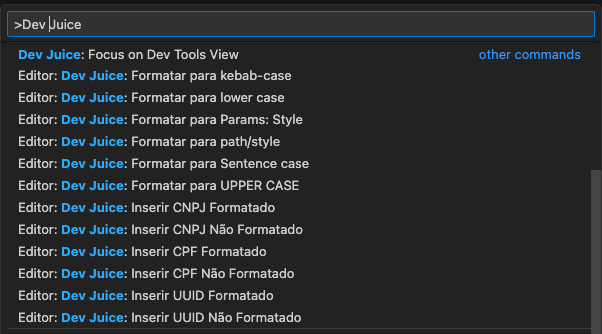
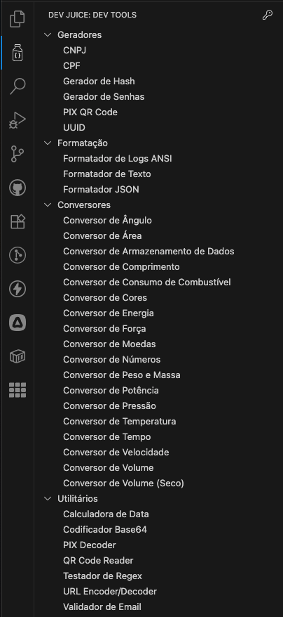

# Dev Juice

Esta extensão do VS Code fornece ferramentas úteis para desenvolvedores.

## Funcionalidades

### Geradores

- ✅ **Gerador de CNPJ**: Números válidos com formatação opcional
- ✅ **Gerador de CPF**: Números válidos com formatação opcional  
- ✅ **Gerador de UUID**: Identificadores únicos universais (v4)
- ✅ **Gerador de PIX**: Códigos QR para pagamentos brasileiros
- ✅ **Gerador de Hash**: MD5, SHA-1, SHA-256, SHA-512
- ✅ **Gerador de Senhas**: Senhas seguras customizáveis

### Utilitários

- ✅ **Formatador JSON**: Formatação e minificação de JSON
- ✅ **Codificador Base64**: Codificação e decodificação
- ✅ **Validador de Email**: Validação individual e em lote
- ✅ **Formatação de texto**: Conversão entre formatos de caso (camelCase, snake_case, etc.)
- ✅ **Conversor de Cores**: HEX, RGB, HSL, HSV
- ✅ **Calculadora de Data**: Diferenças e cálculos temporais
- ✅ **URL Encoder/Decoder**: Codificação segura de URLs
- ✅ **QR Code Reader**: Leitura de códigos QR de imagens
- ✅ **PIX QR Code Decoder**: Decodificação completa de códigos PIX

### Conversores

- ✅ **Conversor de Ângulo**: Graus, radianos, etc.
- ✅ **Conversor de Área**: m², km², hectares, etc.
- ✅ **Conversor de Armazenamento de Dados**: Bytes, KB, MB, GB, etc.
- ✅ **Conversor de Comprimento**: Metros, pés, milhas, etc.
- ✅ **Conversor de Consumo de Combustível**: L/100km, mpg, etc.
- ✅ **Conversor de Energia**: Joules, calorias, etc.
- ✅ **Conversor de Força**: Newtons, libras-força, etc.
- ✅ **Conversor de Moedas**: Conversão entre moedas
- ✅ **Conversor de Números**: Decimal, binário, hexadecimal, etc.
- ✅ **Conversor de Peso e Massa**: Gramas, quilos, libras, etc.
- ✅ **Conversor de Potência**: Watts, cavalos-vapor, etc.
- ✅ **Conversor de Pressão**: Pascal, bar, psi, etc.
- ✅ **Conversor de Temperatura**: Celsius, Fahrenheit, Kelvin
- ✅ **Conversor de Tempo**: Segundos, minutos, horas, etc.
- ✅ **Conversor de Velocidade**: km/h, m/s, mph, etc.
- ✅ **Conversor de Volume**: Litros, mililitros, galões, etc.
- ✅ **Conversor de Volume (Seco)**: Litros, galões secos, etc.

## Comandos Disponíveis

A extensão oferece comandos para inserção rápida de valores gerados diretamente no editor:

- `Dev Juice: Inserir CNPJ Formatado`
- `Dev Juice: Inserir CNPJ Não Formatado`
- `Dev Juice: Inserir CPF Formatado`
- `Dev Juice: Inserir CPF Não Formatado`
- `Dev Juice: Inserir UUID Formatado`
- `Dev Juice: Inserir UUID Não Formatado`

E vários comandos para formatação de texto (camelCase, snake_case, PascalCase, etc.)

## Como usar

Veja detalhes de uso de cada funcionalidade no arquivo [FEATURES.md](FEATURES.md).

1. Abra o painel do Dev Juice clicando no ícone na Activity Bar
2. Selecione a ferramenta desejada na lista
3. Para geradores com interface gráfica, uma nova aba será aberta com o formulário
4. Para inserção rápida no código, use os comandos disponíveis na paleta de comandos (Ctrl+Shift+P ou Cmd+Shift+P)

## Contribuições

Contribuições são bem-vindas! Se você gostaria de contribuir com o projeto ou solicitar novas funcionalidades, consulte nosso [guia de contribuição](CONTRIBUTING.md).

## Release Notes

### 1.0.0

- Lançamento inicial com todas as funcionalidades implementadas

## Licença

Este projeto está licenciado sob a licença MIT - veja o arquivo [LICENSE](LICENSE) para detalhes.

**Aproveite!**
